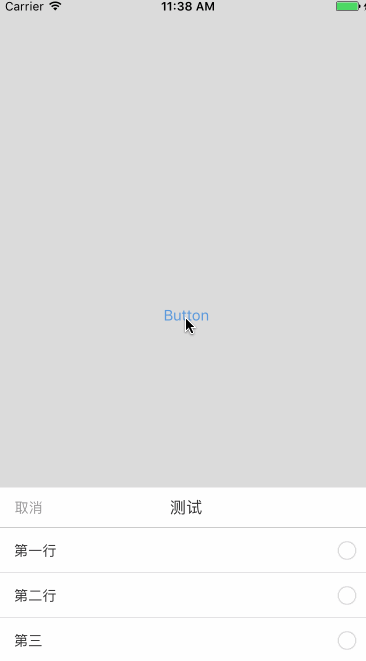

# YJSelectionView

这是一款轻量级支持多选和多选窗的控件，可以记录上一次的选择。使用方便，效果舒适养眼。


### 实现效果



### 控件特点
* 视图添加在`UIWindow`之上，减少对现有结构造成的影响
* 控件中不需要使用其他第三方库，减少依赖
* 多选单选两种模式选择，可配置是否记忆上次选择

### 如何使用

1. 复制`YJSelectionView`文件夹(包含YJSelectionView类，和两张图片)到你自己的项目。

2. 仅仅需要一行代码,(参数的具体意义请看`YJSelectionView`的头文件)

``` objectivec
	[YJSelectionView showWithTitle:@"测试" options:@[@"第一行", @"第二行", @"第三"] singleSelection:YES delegate:self completionHandler:^(NSInteger index, NSArray *array) {
        NSLog(@"%ld", index);
        for (id obj in array) {
            NSLog(@"%@", obj);
        }
    }];
```

同时可通过下方属性配置是否记忆上一次的存储

``` objectivec
@property (nonatomic, assign) BOOL canMemory;// 是否记忆这次的选择在下次打开后展示 默认为YES
```

### 更新历史
首次提交 2017.5.27  